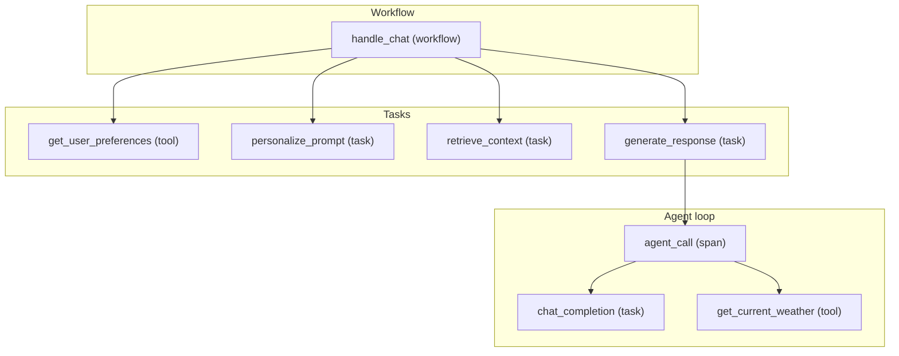

# Tracing capabilities – demo diagram

This doc describes how tracing works in this demo and what you see in Elastic.

## 1. Services and OTLP flow

```
┌─────────────┐     HTTP (traceparent)      ┌─────────────┐     HTTP      ┌─────────┐
│   Browser   │ ──────────────────────────► │   App       │ ─────────────► │ LiteLLM │
│   (user)    │     POST /api/chat          │ :8088       │  OpenAI API   │ :4000    │
└─────────────┘                             │ Traceloop   │  + traceparent│ OTEL    │
                                             └──────┬──────┘  (optional)   └────┬────┘
                                                    │                         │
                                                    │ OTLP HTTP :4318          │ OTLP HTTP :4318
                                                    ▼                         ▼
                                             ┌──────────────────────────────────────────┐
                                             │     OpenTelemetry Collector              │
                                             │     traces / metrics / logs → pipeline   │
                                             └────────────────────┬─────────────────────┘
                                                                    │ OTLP → Elastic APM
                                                                    ▼
                                             ┌──────────────────────────────────────────┐
                                             │     Elastic APM Server (:8200)            │
                                             │     → Kibana Observability                │
                                             └──────────────────────────────────────────┘
                                                                           │
                                    LiteLLM also forwards to ──────────────┘
                                             ┌─────────────┐
                                             │   Ollama    │  (or OpenAI)
                                             │   :11434    │
                                             └─────────────┘
```

- **App** (chatbot-service): Traceloop SDK instruments workflows, tasks, tools, and the OpenAI client. Sends OTLP to the collector. Can send `traceparent` (and `tracestate`) on requests to LiteLLM so proxy spans join the same trace (`PROPAGATE_TRACE_TO_LITELLM=true`).
- **LiteLLM** (litellm-proxy): OTEL callback creates spans (e.g. "Received Proxy Server Request"). Exports OTLP to the same collector. When it receives `traceparent`, it continues that trace.
- **Collector**: Single pipeline for all services; no overwriting of `service.name`, so Elastic shows both `chatbot-service` and `litellm-proxy`.

---

## 2. Trace span hierarchy (one chat request)

What a single `/api/chat` request looks like in Elastic when tools are enabled and the user asks something that triggers the agent (e.g. weather in Texas):



- **handle_chat**: One workflow per chat request; root of the trace.
- **get_user_preferences** (tool): Optional; runs when the request includes a `name` for personalization.
- **personalize_prompt** (task): Optional; builds a short system line from the resolved **name** only (no preference blob).
- **retrieve_context** (task): RAG-style retrieval (stub); adds context to the prompt.
- **generate_response** (task): Builds the final prompt and either runs the agent or a single LLM call.
- **agent_call** (span): Explicit OpenTelemetry span that wraps the agent loop when `CHATBOT_USE_TOOLS=true`.
- **chat_completion** (task): Each LLM request (can appear multiple times in one trace when the model uses tools).
- **get_current_weather** (tool): Runs when the model calls the weather tool; may run inside `agent_call` after a `chat_completion` that returned tool_calls.

When **PROPAGATE_TRACE_TO_LITELLM=true**, the same trace in Elastic also includes spans from **litellm-proxy** (e.g. "Received Proxy Server Request") as siblings or children of the HTTP call from the app to LiteLLM.

---

## 3. What each component traces

| Component        | Source              | Spans / attributes you get |
|-----------------|---------------------|----------------------------|
| App             | Traceloop + OTEL    | Workflow/task/tool spans; `llm.*` and token usage from OpenAI instrumentation; `agent_call` with `llm.agent`, `agent.turns`; custom attributes (e.g. `prompt.template`, `retrieval.num_results`, **`prompt.category`** / **`chat.use_case`** per chat). |
| LiteLLM proxy   | LiteLLM OTEL callback | Request span (e.g. "Received Proxy Server Request"); request/response as attributes when enabled. |
| Collector       | OTLP pipeline       | Batched traces/metrics/logs; no `service.name` overwrite, so both `chatbot-service` and `litellm-proxy` appear in Elastic. |
| Elastic         | APM Server          | Services, transactions, spans, and (if enabled) token metrics in Observability → APM. |

### Use case (prompt category)

Each `POST /api/chat` sends a validated **use case** (`category` in the JSON body; see `GET /api/prompt/categories`). It appears in four places:

| Where | What to look for |
|-------|------------------|
| **Elastic / span attributes** | `prompt.category` and `chat.use_case` on the HTTP/request span, plus flat aliases `prompt_category` and `use_case` for easier filtering; span event **`chat.request`** with `prompt.category`. |
| **App logs** | `chat request use_case=... session_id=... trace_id=... turn=...` — match `trace_id` (32 hex chars) to the trace in APM. |
| **Web UI Traceflow** | The `handle_chat` row’s context line: `use case: … · session=…` (from the `traceflow` object in the chat API response). |
| **`user.session_id`** | Same span attribute as the session header `X-Session-ID` (or server-generated UUID). |

### MCP fetch (`fetch_url`)

When **`MCP_FETCH_ENABLED=true`** and **`CHATBOT_USE_TOOLS=true`**, the model can call **`fetch_url`**, which runs the official Python package **`mcp-server-fetch`** as a **stdio** subprocess (new session per call; retries on flaky init).

| Signal | Where it appears |
|--------|------------------|
| Traceloop tool span | **`fetch_url`** (same pattern as other `@tool` functions). |
| Manual OTEL span | **`mcp.tool.fetch`** with attributes **`mcp.server`** (`mcp_server_fetch`), **`mcp.tool.name`** (`fetch`), **`url.host`** (parsed hostname only). |
| Elastic | Under **`chatbot-service`**, typically nested under **`agent_call`** / **`generate_response`** / **`handle_chat`** like other tools—no separate MCP service unless you export OTLP from another process. |

---

## 4. Env vars that affect tracing

| Variable                    | Effect |
|----------------------------|--------|
| `PROPAGATE_TRACE_TO_LITELLM` | `true` → app sends traceparent to LiteLLM so proxy spans are in the same trace. |
| `CHATBOT_USE_TOOLS`        | `true` → agent loop runs; you see `agent_call` and tool spans (e.g. `get_current_weather`). Default in compose is `false` (tinyllama); set `true` for tool-capable models. |
| `MCP_FETCH_ENABLED`        | `true` → OpenAI tool `fetch_url` is registered; each call runs the official **mcp-server-fetch** MCP server over stdio. Look for Traceloop **`fetch_url`** plus OTEL span **`mcp.tool.fetch`** (`mcp.server`, `mcp.tool.name`, `url.host`). |
| `TRACELOOP_TRACE_CONTENT`  | `false` → prompt/completion content not sent to Elastic. |
| `OTEL_EXPORTER_OTLP_ENDPOINT` (app) | Where the app sends OTLP (default: collector :4318). |
| `OTEL_TRACES_EXPORTER`, `OTEL_EXPORTER_OTLP_*` (LiteLLM) | LiteLLM OTLP export to the same collector. |
